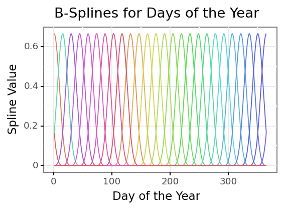
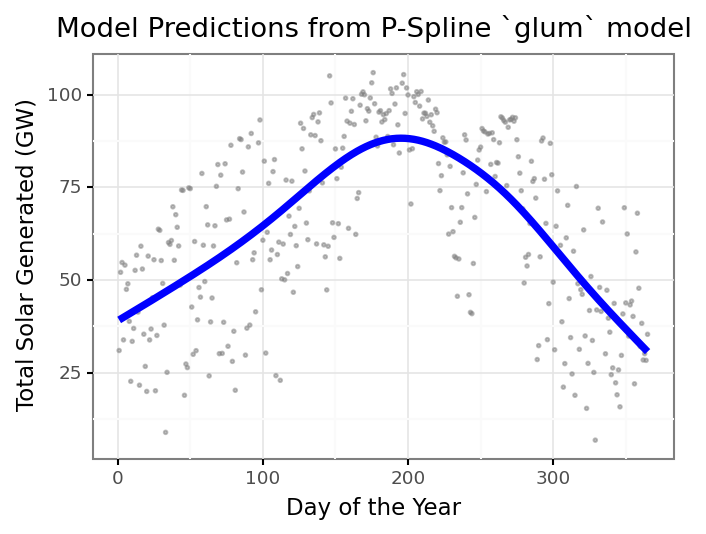
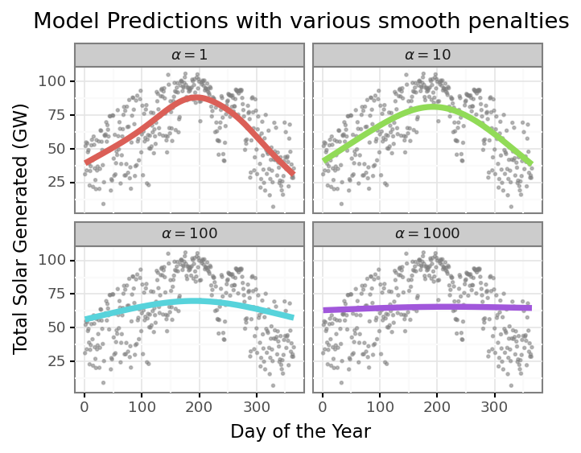
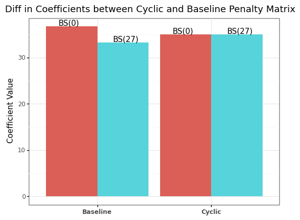
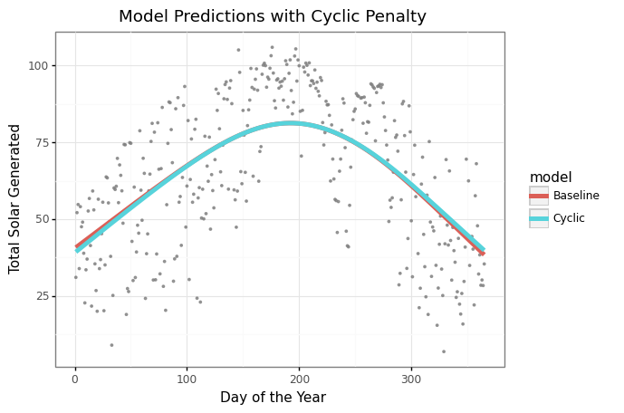

# How to fit Penalized Splines with the glum library

I recently discovered a new python library for fitting GLMs called
[glum](https://glum.readthedocs.io/en/latest/index.html). This package
is developed not only to be
[fast](https://glum.readthedocs.io/en/latest/benchmarks.html) but also
allows custom penalties for different terms in the model, as well as
including your own penalty matrix in your model fitting. This could
allow us to include spline terms in our models ala GAMs fit using
`pygam` or `mgcv` in `R`. The speed and flexibility is enticing enough
that I thought it would be fun to begin building some tools that allow
us to use penalized splines in `glum` and learn more to potentially
assist with including this functionality in the package itself.

My goal in this post is to work through a workflow to combine the basis
splines that `scikit-learn` can now produce with a custom difference
matrix times as inputs to a `glum` model that will “think” its just
fitting a normal GLM. Then we can work on buidling out a more
comprehensive workflow in later posts.

#### Background Info

If you are unfamiliar with Penalized Splines I would highly encourage
reading [A Crash Course on
P-Splines](http://ce.esalq.usp.br/sites/default/files/Crash_course_handout.pdf)
from Eilers and Marx. Basically a P-Spline (**P**enalized Spline) is a
basis spline with a custom penalty matrix that enforces constraints on
the spline coefficients. Normally this constraint is just smoothness (we
don’t want the neighboring spline coefficients to differ too much unless
the data forces it in that direction), but it can also be extended to
cyclic constraints (e.g. the first and last week of an annual effect
could be equal) or monotonic constraints. Their big takeaway is that you
can enforce these constraints just with a well designed penalty matrix.
Since `glum` allows us to pass our own penalty matrix for the model
coefficients we should be able to recreate P-Splines in our own model.

#### Generating B-Splines

Basis Splines are the unpenalized splines that give our model its
flexibility. There are many resources to learn more about them including
the Crash Course I linked to above so I won’t get into them here. As of
version 1.0 `scikit-learn` has included a `SplineTransformer` in its
`preprocessing` module. This will generate our B-splines for a given
feature in our model. Since the point of this post isn’t really to
explain what B-splines are I’ll just show the end product of splines we
end up with.



Each colored line is an individual B-spline that covers a range of our
original feature, the days of the year. I like to think of it as each
spline is only “activated” over a small portion of the range of values
of the original feature. But for any given feature value there will be 3
active splines at that value (the degree of the spline matches this
number). We take these “raw” B-splines and then weight them and sum them
together to predict our dependent variable; using them as features to a
regression model does this automatically.

#### The Model

Now that we have our B-spline features to use in our model we need our
penalty matrix. Because we can have many B-splines across the feature
distribution we need a way to prevent overfitting. A common method for
reduce overfitting is to enforce “smoothness” within the model. If you
want to read more about why we choose this value to penalize I would
recommend [Simon Wood’s
book](https://www.routledge.com/Generalized-Additive-Models-An-Introduction-with-R-Second-Edition/Wood/p/book/9781498728331)
on Generalized Additive Models. Smoothness can be expressed as saying we
don’t want the coefficients of neighboring splines to differ too much.
Since our splines multiplied by the coefficients contribute to the
prediction at neighboring regions of our original feature distribution
this will cause the entire predicted curve to be “smooth”. In math we
might have a series of coefficients $\beta_i$ and we need to keep track
of the differences between successive pairs.
$$ Penalty = (\beta_1 - \beta_0) + (\beta_2 - \beta_1) + ... $$

This is called a difference matrix and has a built in function in
`numpy` for us to use. We actually use the 2nd difference matrix, which
is the difference between the differences of the coefficients, for even
smoother coefficients.

``` python
## We feed np.diff a diagonal matrix of 1's for each of our splines
## n = 2 tells us we want the 2nd difference 
## axis = 0 is to calculate the difference across the rows
penalty_matr = np.diff(np.diag(np.ones(num_splines)), n = 2, axis = 0)
p2 = np.dot(penalty_matr.T, penalty_matr)
```

In our optimization function we simply use the difference matrix
directly with the coefficient vector. However `glum` requires a
`(n_features, n_features)` matrix and we lose a row everytime we do the
difference operation. We can simply pass the transpose times the
original difference matrix to get back to a square penalty matrix. This
actually matches what the solution would be if we were to solve for the
coefficients directly ($\beta * D^TD * \beta$ / `w * D'D * w` ), so I
think this is fine. Now we just need to build our model using `glum`

``` python
daily_solar_gam = GeneralizedLinearRegressor(alpha = 1, P2 = p2, fit_intercept = False)
daily_solar_gam.fit(X = daily_solar_spline, y = daily_solar_df['power_gw'])
```

It’s that easy, lets look at our predictions.



We now have a way to include smoothing spline terms in our GLM in
`glum`! We can use `glum` to easily see different levels of the penalty
amount and how that forces different shapes of our curve.



We could then use a more formal evaluation criteria like GCV or AIC to
pick the optimal level of smoothing. Here is looks like $\alpha = 10$ is
the optimal level of smoothing, to use the `glum` notation.

Maybe you are asking why this is a big deal; we could just include the
B-splines as features in any model and get this non-linear relationship.
The penalties and difference matrix allow us to control the smoothing
directly. If we had simply used an L2 penalty without the difference
matrix we would penalize the size of the coefficients but not the
smoothness; this could produce more jumps and rougher edges at the knot
locations as one spline cycles on and another cycles off. And we can
also incorporate more constraints into the penalty matrix that give us
even more control over our model. Lets say that we think the daily solar
output for the year should be cyclical, i.e. the first and last day
should produce the same amount of energy on average. This ignores any
growth within that year of new solar panels, but this is just a toy
example so assume that we are only estimating the annual component for
now. We can do this by simply adding a row to our penalty matrix that
penalizes the difference between the last coefficient and the first.
Since the last coefficient corresponds to the very end of the year, and
the first coefficient to the very beginning of the year, this will add a
penalty to make them similar unless the data overrides this constraint.
Here is how we would make that change to our penalty matrix:

``` python
cyclic_row = np.zeros(penalty_matr.shape[1])
# D * B means we want (B_0 - B_26)
cyclic_row[0] = 1
cyclic_row[-1] = -1
cyclic_matr = np.vstack([penalty_matr, cyclic_row])
cyclic_penalty = 10 ## matches the baseline model we will use
p2_cyclic = np.dot(cyclic_matr.T, cyclic_matr)
```

Fitting a model with `p2_cyclic` is just as easy as our baseline model.

``` python
daily_solar_gam_base = GeneralizedLinearRegressor(alpha = cyclic_penalty, P2 = p2, fit_intercept = False)
daily_solar_gam_base.fit(X = daily_solar_spline, y = daily_solar_df['power_gw'])
daily_solar_gam_cyclic = GeneralizedLinearRegressor(alpha = cyclic_penalty, P2 = p2_cyclic, fit_intercept = False)
daily_solar_gam_cyclic.fit(X = daily_solar_spline, y = daily_solar_df['power_gw'])
base_coefs = daily_solar_gam_base.coef_
cyclic_coefs = daily_solar_gam_cyclic.coef_
```

Now we can compare the two end-coefficients between the models to show
our cyclic penalty has made the endpoints much similar.



Lets see how the overall curve shape looks with this new penalty
compared to the baseline model.



The cyclic model is pretty similar to the original model’s curve because
the data is already pretty symetric. But, now we can ensure our
coefficients reflect exactly what we want them to measure.

I hope you enjoyed this brief introduction to both P-splines and the
`glum` package. I’m excited to explore this new package more and
hopefully assist with getting this capability folded into the package
itself. I hope to follow this post with showing how we can incorporate
multiple spline terms in one model using this method.

You can view the python code for this blog post on my github
[here](link). Relatedly I wrote this blog post using the new `quarto`
literatte programming document format. If anyone has used quarto with
python, VS Code, or github pages I’d love to hear your feedback on how
it went!
