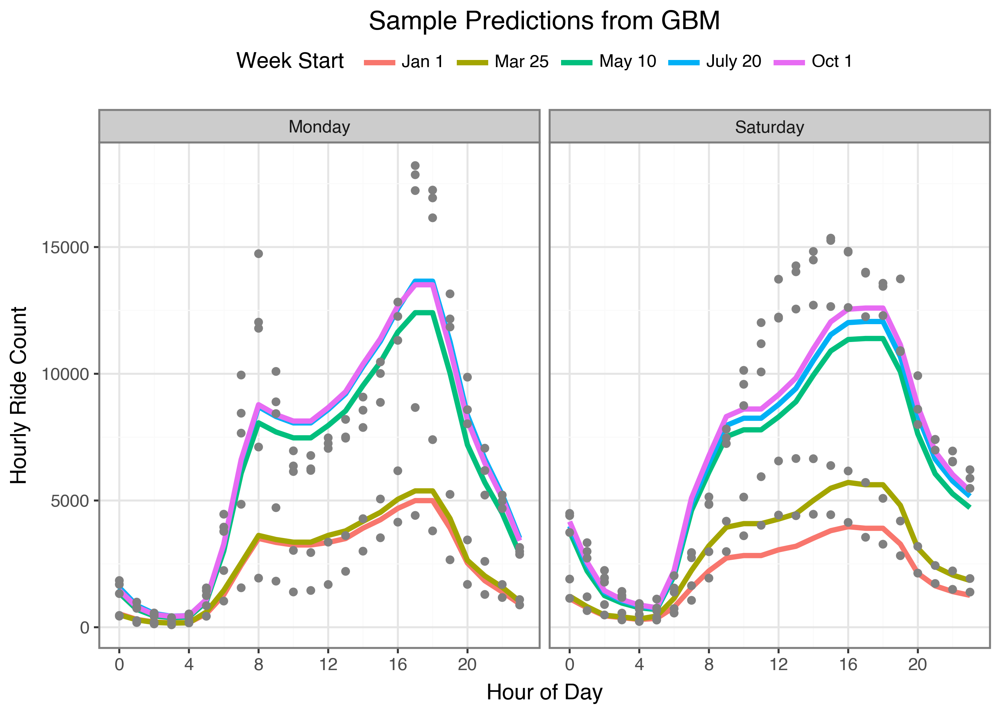
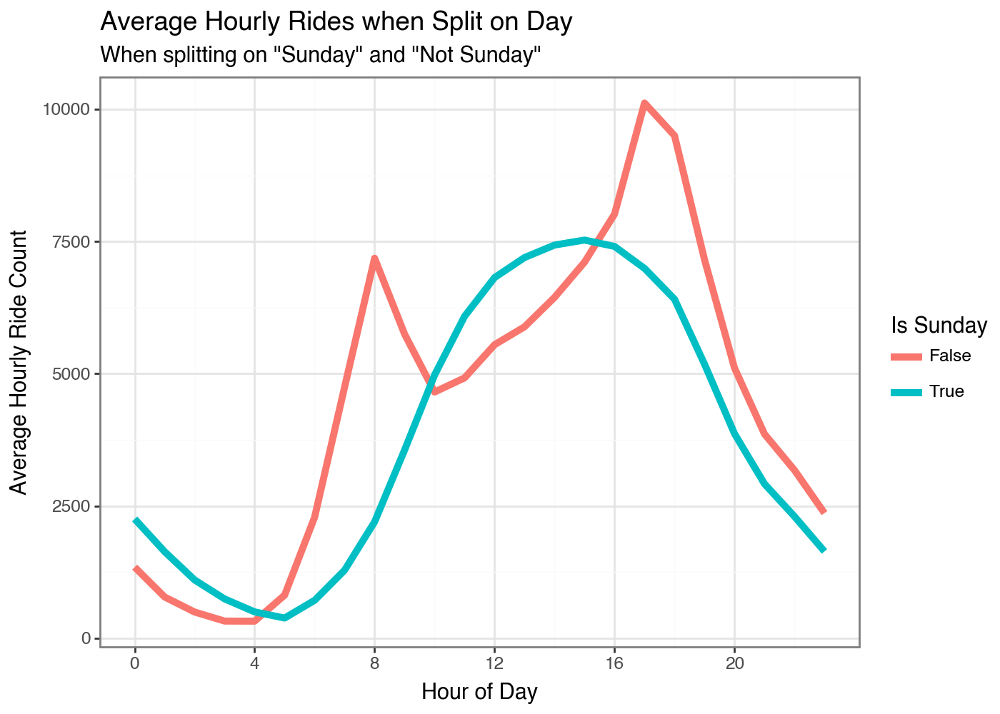
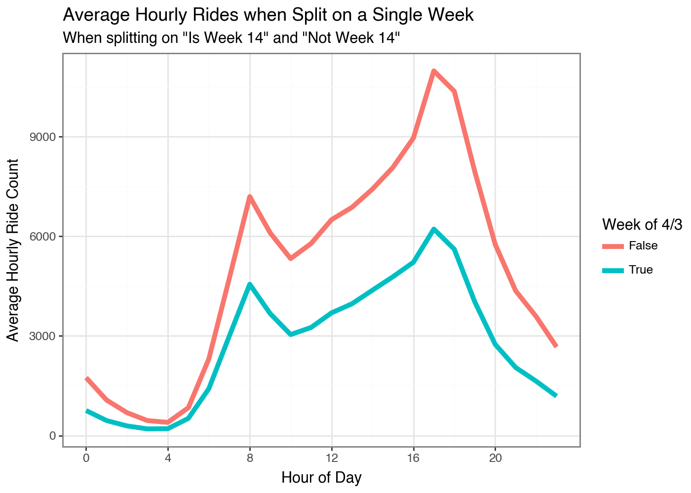
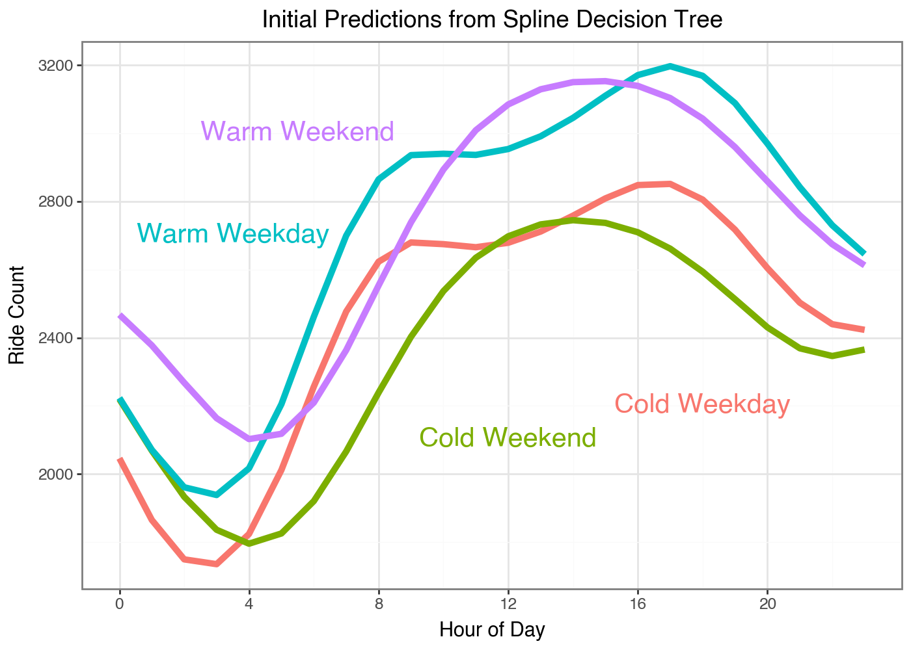
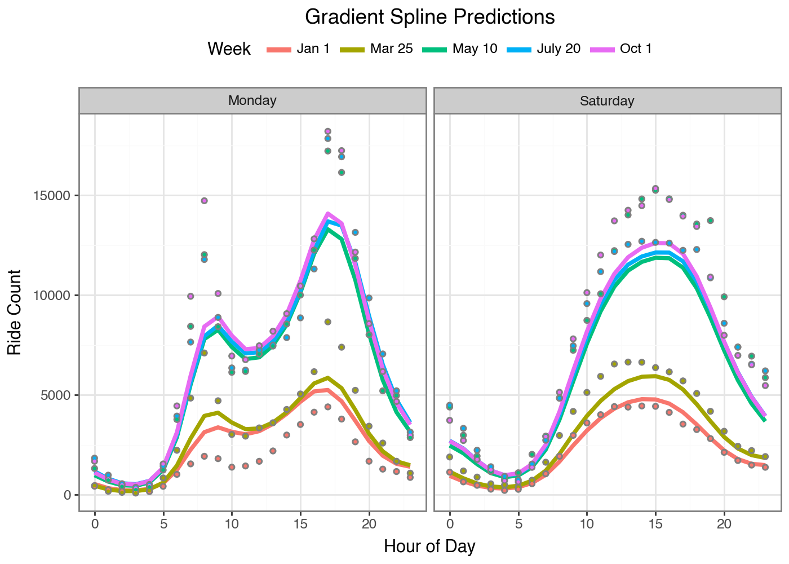

---
execute:
  echo: false
  fig-dpi: 200
  warning: false
title: Gradient Boosting Parameters
toc-title: Table of contents
---

In this post I'll walk through how you can use the same principles
behind Gradient Boosting Machines (GBM) to predict *parameters* of
models in the same way traditional GBMs predict 1-dimensional targets.
This allows us to get the benefits of Gradient Boosting (large feature
sets, high dimensional interactions, modeling at scale) to fit things
like smoothing splines, survival analaysis, and probabilistic models.
Its not a [modeling silver
bullet](https://multithreaded.stitchfix.com/blog/2015/07/30/gam/), but I
think this approach can be a usefull tool to add to your modeling
toolkit. Plus walking through this helped me understand gradient
boosting at a deeper level than I did before, so hopefully you feel the
same.

### Gradient Boosting

Gradient Boosting is a Machine Learning algorithm that fits a series of
decision trees; each successive tree attempts to improve the predictions
from the set of previous trees. It (generally, there are many GBM
implementations out there now) does this with two steps: 1. Before
fitting a new tree calculate the gradient of the loss function we are
minimizing at each observation 2. Fit a new decision tree that
predicts\^\* this gradient and then add this prediction to the previous
predictions.

*(\*) technically fit the negative gradient, we want the loss to go
down*

Recently I was reading about [Generalized Random
Forests](https://arxiv.org/abs/1610.01271) (GRF) to learn how they used
Random Forests to fit more complicated models than just regression and
classification. This post started as a walkthrough of that technique,
but I ended up trying something I've always had an idea for first; Can
we use a GBM to fit distributions, not just make individual predictions?
To test this I am goinging to walk through using Gradient Boosting to
learn the coefficients for a spline function. We will use the Citi Bike
Dataset to model the number of hourly rides over the course of a day.

\[chart_that_shows_splines\]

::: {.cell execution_count="3"}
::: {.cell-output .cell-output-display execution_count="16"}
```{=html}
<div><style>
.dataframe > thead > tr,
.dataframe > tbody > tr {
  text-align: right;
  white-space: pre-wrap;
}
</style>
<small>shape: (5, 7)</small>
```
  hour_start            ride_date    ride_hour   ride_count   weather_tmin_c   weather_tmax_c   weather_prcp_mm
  --------------------- ------------ ----------- ------------ ---------------- ---------------- -----------------
  datetime\[μs\]        date         i64         u32          f64              f64              f64
  2022-01-01 00:00:00   2022-01-01   0           1246         10.0             13.9             19.3
  2022-01-01 01:00:00   2022-01-01   1           1379         10.0             13.9             19.3
  2022-01-01 02:00:00   2022-01-01   2           1141         10.0             13.9             19.3
  2022-01-01 03:00:00   2022-01-01   3           578          10.0             13.9             19.3
  2022-01-01 04:00:00   2022-01-01   4           323          10.0             13.9             19.3

```{=html}
</div>
```
:::
:::

### The Data

I've downloaded 4 years of the Citi Bike usage data and aggregated by
the number of reachs in each hour of each day. Then I've also added the
high and low temperature for that day as well as the inches of rain. If
this were a proper forecasting model you'd want the *predicted* weather
for a day so your model was properly calibrated but this is fine for
having features to learn parameters from. One unique thing about this
data is that I have stored the hourly ride counts and the hour of the
day in an aggregated polars array. This is so the splits will work on
the daily level, since I need to generate spline coefficients for each
day and apply them to the 24 hour range. If I was using a traditional
GBM I would use the `ride_hour` as a feature and predict the hourly
counts.

::: {.cell execution_count="6"}
::: {.cell-output .cell-output-display execution_count="19"}
```{=html}
<div><style>
.dataframe > thead > tr,
.dataframe > tbody > tr {
  text-align: right;
  white-space: pre-wrap;
}
</style>
<small>shape: (5, 9)</small>
```
  dow   woy   year   high_temp   low_temp   precip      ride_date    ride_hour          ride_count
  ----- ----- ------ ----------- ---------- ----------- ------------ ------------------ --------------------------
  i8    i8    i32    f64         f64        f64         date         array\[i64, 24\]   array\[u32, 24\]
  5     38    2022   51.98       64.04      0.0         2022-09-23   \[0, 1, ... 23\]   \[1458, 782, ... 2465\]
  1     3     2023   30.2        48.02      0.0         2023-01-16   \[0, 1, ... 23\]   \[564, 318, ... 827\]
  4     34    2024   62.06       77.0       0.0         2024-08-22   \[0, 1, ... 23\]   \[1840, 999, ... 4037\]
  5     26    2025   64.04       73.94      0.0787402   2025-06-27   \[0, 1, ... 23\]   \[2791, 1683, ... 5395\]
  3     34    2024   59.0        75.02      0.0         2024-08-21   \[0, 1, ... 23\]   \[1744, 903, ... 3445\]

```{=html}
</div>
```
:::
:::

Lets use this data to fit a traditional GBM on the hourly data and
visualize some results.

::: {.cell execution_count="7"}
``` {.python .cell-code}
hourly_df = hourly_df.join(zero_days_df, how='anti', on='ride_date')

X_hourly = hourly_df[FEATURE_COLS + ['ride_hour']].to_numpy()
y_hourly = hourly_df['ride_count'].to_numpy()
y_hourly_log = np.log1p(y_hourly)

hourly_gbm = GradientBoostingRegressor(min_samples_leaf=4, validation_fraction=0.05)
hourly_gbm.fit(X_hourly, y_hourly_log)
```

::: {.cell-output .cell-output-display execution_count="20"}
```{=html}
<style>#sk-container-id-2 {
  /* Definition of color scheme common for light and dark mode */
  --sklearn-color-text: #000;
  --sklearn-color-text-muted: #666;
  --sklearn-color-line: gray;
  /* Definition of color scheme for unfitted estimators */
  --sklearn-color-unfitted-level-0: #fff5e6;
  --sklearn-color-unfitted-level-1: #f6e4d2;
  --sklearn-color-unfitted-level-2: #ffe0b3;
  --sklearn-color-unfitted-level-3: chocolate;
  /* Definition of color scheme for fitted estimators */
  --sklearn-color-fitted-level-0: #f0f8ff;
  --sklearn-color-fitted-level-1: #d4ebff;
  --sklearn-color-fitted-level-2: #b3dbfd;
  --sklearn-color-fitted-level-3: cornflowerblue;

  /* Specific color for light theme */
  --sklearn-color-text-on-default-background: var(--sg-text-color, var(--theme-code-foreground, var(--jp-content-font-color1, black)));
  --sklearn-color-background: var(--sg-background-color, var(--theme-background, var(--jp-layout-color0, white)));
  --sklearn-color-border-box: var(--sg-text-color, var(--theme-code-foreground, var(--jp-content-font-color1, black)));
  --sklearn-color-icon: #696969;

  @media (prefers-color-scheme: dark) {
    /* Redefinition of color scheme for dark theme */
    --sklearn-color-text-on-default-background: var(--sg-text-color, var(--theme-code-foreground, var(--jp-content-font-color1, white)));
    --sklearn-color-background: var(--sg-background-color, var(--theme-background, var(--jp-layout-color0, #111)));
    --sklearn-color-border-box: var(--sg-text-color, var(--theme-code-foreground, var(--jp-content-font-color1, white)));
    --sklearn-color-icon: #878787;
  }
}

#sk-container-id-2 {
  color: var(--sklearn-color-text);
}

#sk-container-id-2 pre {
  padding: 0;
}

#sk-container-id-2 input.sk-hidden--visually {
  border: 0;
  clip: rect(1px 1px 1px 1px);
  clip: rect(1px, 1px, 1px, 1px);
  height: 1px;
  margin: -1px;
  overflow: hidden;
  padding: 0;
  position: absolute;
  width: 1px;
}

#sk-container-id-2 div.sk-dashed-wrapped {
  border: 1px dashed var(--sklearn-color-line);
  margin: 0 0.4em 0.5em 0.4em;
  box-sizing: border-box;
  padding-bottom: 0.4em;
  background-color: var(--sklearn-color-background);
}

#sk-container-id-2 div.sk-container {
  /* jupyter's `normalize.less` sets `[hidden] { display: none; }`
     but bootstrap.min.css set `[hidden] { display: none !important; }`
     so we also need the `!important` here to be able to override the
     default hidden behavior on the sphinx rendered scikit-learn.org.
     See: https://github.com/scikit-learn/scikit-learn/issues/21755 */
  display: inline-block !important;
  position: relative;
}

#sk-container-id-2 div.sk-text-repr-fallback {
  display: none;
}

div.sk-parallel-item,
div.sk-serial,
div.sk-item {
  /* draw centered vertical line to link estimators */
  background-image: linear-gradient(var(--sklearn-color-text-on-default-background), var(--sklearn-color-text-on-default-background));
  background-size: 2px 100%;
  background-repeat: no-repeat;
  background-position: center center;
}

/* Parallel-specific style estimator block */

#sk-container-id-2 div.sk-parallel-item::after {
  content: "";
  width: 100%;
  border-bottom: 2px solid var(--sklearn-color-text-on-default-background);
  flex-grow: 1;
}

#sk-container-id-2 div.sk-parallel {
  display: flex;
  align-items: stretch;
  justify-content: center;
  background-color: var(--sklearn-color-background);
  position: relative;
}

#sk-container-id-2 div.sk-parallel-item {
  display: flex;
  flex-direction: column;
}

#sk-container-id-2 div.sk-parallel-item:first-child::after {
  align-self: flex-end;
  width: 50%;
}

#sk-container-id-2 div.sk-parallel-item:last-child::after {
  align-self: flex-start;
  width: 50%;
}

#sk-container-id-2 div.sk-parallel-item:only-child::after {
  width: 0;
}

/* Serial-specific style estimator block */

#sk-container-id-2 div.sk-serial {
  display: flex;
  flex-direction: column;
  align-items: center;
  background-color: var(--sklearn-color-background);
  padding-right: 1em;
  padding-left: 1em;
}


/* Toggleable style: style used for estimator/Pipeline/ColumnTransformer box that is
clickable and can be expanded/collapsed.
- Pipeline and ColumnTransformer use this feature and define the default style
- Estimators will overwrite some part of the style using the `sk-estimator` class
*/

/* Pipeline and ColumnTransformer style (default) */

#sk-container-id-2 div.sk-toggleable {
  /* Default theme specific background. It is overwritten whether we have a
  specific estimator or a Pipeline/ColumnTransformer */
  background-color: var(--sklearn-color-background);
}

/* Toggleable label */
#sk-container-id-2 label.sk-toggleable__label {
  cursor: pointer;
  display: flex;
  width: 100%;
  margin-bottom: 0;
  padding: 0.5em;
  box-sizing: border-box;
  text-align: center;
  align-items: start;
  justify-content: space-between;
  gap: 0.5em;
}

#sk-container-id-2 label.sk-toggleable__label .caption {
  font-size: 0.6rem;
  font-weight: lighter;
  color: var(--sklearn-color-text-muted);
}

#sk-container-id-2 label.sk-toggleable__label-arrow:before {
  /* Arrow on the left of the label */
  content: "▸";
  float: left;
  margin-right: 0.25em;
  color: var(--sklearn-color-icon);
}

#sk-container-id-2 label.sk-toggleable__label-arrow:hover:before {
  color: var(--sklearn-color-text);
}

/* Toggleable content - dropdown */

#sk-container-id-2 div.sk-toggleable__content {
  display: none;
  text-align: left;
  /* unfitted */
  background-color: var(--sklearn-color-unfitted-level-0);
}

#sk-container-id-2 div.sk-toggleable__content.fitted {
  /* fitted */
  background-color: var(--sklearn-color-fitted-level-0);
}

#sk-container-id-2 div.sk-toggleable__content pre {
  margin: 0.2em;
  border-radius: 0.25em;
  color: var(--sklearn-color-text);
  /* unfitted */
  background-color: var(--sklearn-color-unfitted-level-0);
}

#sk-container-id-2 div.sk-toggleable__content.fitted pre {
  /* unfitted */
  background-color: var(--sklearn-color-fitted-level-0);
}

#sk-container-id-2 input.sk-toggleable__control:checked~div.sk-toggleable__content {
  /* Expand drop-down */
  display: block;
  width: 100%;
  overflow: visible;
}

#sk-container-id-2 input.sk-toggleable__control:checked~label.sk-toggleable__label-arrow:before {
  content: "▾";
}

/* Pipeline/ColumnTransformer-specific style */

#sk-container-id-2 div.sk-label input.sk-toggleable__control:checked~label.sk-toggleable__label {
  color: var(--sklearn-color-text);
  background-color: var(--sklearn-color-unfitted-level-2);
}

#sk-container-id-2 div.sk-label.fitted input.sk-toggleable__control:checked~label.sk-toggleable__label {
  background-color: var(--sklearn-color-fitted-level-2);
}

/* Estimator-specific style */

/* Colorize estimator box */
#sk-container-id-2 div.sk-estimator input.sk-toggleable__control:checked~label.sk-toggleable__label {
  /* unfitted */
  background-color: var(--sklearn-color-unfitted-level-2);
}

#sk-container-id-2 div.sk-estimator.fitted input.sk-toggleable__control:checked~label.sk-toggleable__label {
  /* fitted */
  background-color: var(--sklearn-color-fitted-level-2);
}

#sk-container-id-2 div.sk-label label.sk-toggleable__label,
#sk-container-id-2 div.sk-label label {
  /* The background is the default theme color */
  color: var(--sklearn-color-text-on-default-background);
}

/* On hover, darken the color of the background */
#sk-container-id-2 div.sk-label:hover label.sk-toggleable__label {
  color: var(--sklearn-color-text);
  background-color: var(--sklearn-color-unfitted-level-2);
}

/* Label box, darken color on hover, fitted */
#sk-container-id-2 div.sk-label.fitted:hover label.sk-toggleable__label.fitted {
  color: var(--sklearn-color-text);
  background-color: var(--sklearn-color-fitted-level-2);
}

/* Estimator label */

#sk-container-id-2 div.sk-label label {
  font-family: monospace;
  font-weight: bold;
  display: inline-block;
  line-height: 1.2em;
}

#sk-container-id-2 div.sk-label-container {
  text-align: center;
}

/* Estimator-specific */
#sk-container-id-2 div.sk-estimator {
  font-family: monospace;
  border: 1px dotted var(--sklearn-color-border-box);
  border-radius: 0.25em;
  box-sizing: border-box;
  margin-bottom: 0.5em;
  /* unfitted */
  background-color: var(--sklearn-color-unfitted-level-0);
}

#sk-container-id-2 div.sk-estimator.fitted {
  /* fitted */
  background-color: var(--sklearn-color-fitted-level-0);
}

/* on hover */
#sk-container-id-2 div.sk-estimator:hover {
  /* unfitted */
  background-color: var(--sklearn-color-unfitted-level-2);
}

#sk-container-id-2 div.sk-estimator.fitted:hover {
  /* fitted */
  background-color: var(--sklearn-color-fitted-level-2);
}

/* Specification for estimator info (e.g. "i" and "?") */

/* Common style for "i" and "?" */

.sk-estimator-doc-link,
a:link.sk-estimator-doc-link,
a:visited.sk-estimator-doc-link {
  float: right;
  font-size: smaller;
  line-height: 1em;
  font-family: monospace;
  background-color: var(--sklearn-color-background);
  border-radius: 1em;
  height: 1em;
  width: 1em;
  text-decoration: none !important;
  margin-left: 0.5em;
  text-align: center;
  /* unfitted */
  border: var(--sklearn-color-unfitted-level-1) 1pt solid;
  color: var(--sklearn-color-unfitted-level-1);
}

.sk-estimator-doc-link.fitted,
a:link.sk-estimator-doc-link.fitted,
a:visited.sk-estimator-doc-link.fitted {
  /* fitted */
  border: var(--sklearn-color-fitted-level-1) 1pt solid;
  color: var(--sklearn-color-fitted-level-1);
}

/* On hover */
div.sk-estimator:hover .sk-estimator-doc-link:hover,
.sk-estimator-doc-link:hover,
div.sk-label-container:hover .sk-estimator-doc-link:hover,
.sk-estimator-doc-link:hover {
  /* unfitted */
  background-color: var(--sklearn-color-unfitted-level-3);
  color: var(--sklearn-color-background);
  text-decoration: none;
}

div.sk-estimator.fitted:hover .sk-estimator-doc-link.fitted:hover,
.sk-estimator-doc-link.fitted:hover,
div.sk-label-container:hover .sk-estimator-doc-link.fitted:hover,
.sk-estimator-doc-link.fitted:hover {
  /* fitted */
  background-color: var(--sklearn-color-fitted-level-3);
  color: var(--sklearn-color-background);
  text-decoration: none;
}

/* Span, style for the box shown on hovering the info icon */
.sk-estimator-doc-link span {
  display: none;
  z-index: 9999;
  position: relative;
  font-weight: normal;
  right: .2ex;
  padding: .5ex;
  margin: .5ex;
  width: min-content;
  min-width: 20ex;
  max-width: 50ex;
  color: var(--sklearn-color-text);
  box-shadow: 2pt 2pt 4pt #999;
  /* unfitted */
  background: var(--sklearn-color-unfitted-level-0);
  border: .5pt solid var(--sklearn-color-unfitted-level-3);
}

.sk-estimator-doc-link.fitted span {
  /* fitted */
  background: var(--sklearn-color-fitted-level-0);
  border: var(--sklearn-color-fitted-level-3);
}

.sk-estimator-doc-link:hover span {
  display: block;
}

/* "?"-specific style due to the `<a>` HTML tag */

#sk-container-id-2 a.estimator_doc_link {
  float: right;
  font-size: 1rem;
  line-height: 1em;
  font-family: monospace;
  background-color: var(--sklearn-color-background);
  border-radius: 1rem;
  height: 1rem;
  width: 1rem;
  text-decoration: none;
  /* unfitted */
  color: var(--sklearn-color-unfitted-level-1);
  border: var(--sklearn-color-unfitted-level-1) 1pt solid;
}

#sk-container-id-2 a.estimator_doc_link.fitted {
  /* fitted */
  border: var(--sklearn-color-fitted-level-1) 1pt solid;
  color: var(--sklearn-color-fitted-level-1);
}

/* On hover */
#sk-container-id-2 a.estimator_doc_link:hover {
  /* unfitted */
  background-color: var(--sklearn-color-unfitted-level-3);
  color: var(--sklearn-color-background);
  text-decoration: none;
}

#sk-container-id-2 a.estimator_doc_link.fitted:hover {
  /* fitted */
  background-color: var(--sklearn-color-fitted-level-3);
}

.estimator-table summary {
    padding: .5rem;
    font-family: monospace;
    cursor: pointer;
}

.estimator-table details[open] {
    padding-left: 0.1rem;
    padding-right: 0.1rem;
    padding-bottom: 0.3rem;
}

.estimator-table .parameters-table {
    margin-left: auto !important;
    margin-right: auto !important;
}

.estimator-table .parameters-table tr:nth-child(odd) {
    background-color: #fff;
}

.estimator-table .parameters-table tr:nth-child(even) {
    background-color: #f6f6f6;
}

.estimator-table .parameters-table tr:hover {
    background-color: #e0e0e0;
}

.estimator-table table td {
    border: 1px solid rgba(106, 105, 104, 0.232);
}

.user-set td {
    color:rgb(255, 94, 0);
    text-align: left;
}

.user-set td.value pre {
    color:rgb(255, 94, 0) !important;
    background-color: transparent !important;
}

.default td {
    color: black;
    text-align: left;
}

.user-set td i,
.default td i {
    color: black;
}

.copy-paste-icon {
    background-image: url(data:image/svg+xml;base64,PHN2ZyB4bWxucz0iaHR0cDovL3d3dy53My5vcmcvMjAwMC9zdmciIHZpZXdCb3g9IjAgMCA0NDggNTEyIj48IS0tIUZvbnQgQXdlc29tZSBGcmVlIDYuNy4yIGJ5IEBmb250YXdlc29tZSAtIGh0dHBzOi8vZm9udGF3ZXNvbWUuY29tIExpY2Vuc2UgLSBodHRwczovL2ZvbnRhd2Vzb21lLmNvbS9saWNlbnNlL2ZyZWUgQ29weXJpZ2h0IDIwMjUgRm9udGljb25zLCBJbmMuLS0+PHBhdGggZD0iTTIwOCAwTDMzMi4xIDBjMTIuNyAwIDI0LjkgNS4xIDMzLjkgMTQuMWw2Ny45IDY3LjljOSA5IDE0LjEgMjEuMiAxNC4xIDMzLjlMNDQ4IDMzNmMwIDI2LjUtMjEuNSA0OC00OCA0OGwtMTkyIDBjLTI2LjUgMC00OC0yMS41LTQ4LTQ4bDAtMjg4YzAtMjYuNSAyMS41LTQ4IDQ4LTQ4ek00OCAxMjhsODAgMCAwIDY0LTY0IDAgMCAyNTYgMTkyIDAgMC0zMiA2NCAwIDAgNDhjMCAyNi41LTIxLjUgNDgtNDggNDhMNDggNTEyYy0yNi41IDAtNDgtMjEuNS00OC00OEwwIDE3NmMwLTI2LjUgMjEuNS00OCA0OC00OHoiLz48L3N2Zz4=);
    background-repeat: no-repeat;
    background-size: 14px 14px;
    background-position: 0;
    display: inline-block;
    width: 14px;
    height: 14px;
    cursor: pointer;
}
</style><body><div id="sk-container-id-2" class="sk-top-container"><div class="sk-text-repr-fallback"><pre>GradientBoostingRegressor(min_samples_leaf=4, validation_fraction=0.05)</pre><b>In a Jupyter environment, please rerun this cell to show the HTML representation or trust the notebook. <br />On GitHub, the HTML representation is unable to render, please try loading this page with nbviewer.org.</b></div><div class="sk-container" hidden><div class="sk-item"><div class="sk-estimator fitted sk-toggleable"><input class="sk-toggleable__control sk-hidden--visually" id="sk-estimator-id-2" type="checkbox" checked><label for="sk-estimator-id-2" class="sk-toggleable__label fitted sk-toggleable__label-arrow"><div><div>GradientBoostingRegressor</div></div><div><a class="sk-estimator-doc-link fitted" rel="noreferrer" target="_blank" href="https://scikit-learn.org/1.7/modules/generated/sklearn.ensemble.GradientBoostingRegressor.html">?<span>Documentation for GradientBoostingRegressor</span></a><span class="sk-estimator-doc-link fitted">i<span>Fitted</span></span></div></label><div class="sk-toggleable__content fitted" data-param-prefix="">
        <div class="estimator-table">
            <details>
                <summary>Parameters</summary>
                
```
  -- --------------------------- -------------------
     loss                        \'squared_error\'
     learning_rate               0.1
     n_estimators                100
     subsample                   1.0
     criterion                   \'friedman_mse\'
     min_samples_split           2
     min_samples_leaf            4
     min_weight_fraction_leaf    0.0
     max_depth                   3
     min_impurity_decrease       0.0
     init                        None
     random_state                None
     max_features                None
     alpha                       0.9
     verbose                     0
     max_leaf_nodes              None
     warm_start                  False
     validation_fraction         0.05
     n_iter_no_change            None
     tol                         0.0001
     ccp_alpha                   0.0
  -- --------------------------- -------------------

```{=html}

            </details>
        </div>
    </div></div></div></div></div><script>function copyToClipboard(text, element) {
    // Get the parameter prefix from the closest toggleable content
    const toggleableContent = element.closest('.sk-toggleable__content');
    const paramPrefix = toggleableContent ? toggleableContent.dataset.paramPrefix : '';
    const fullParamName = paramPrefix ? `${paramPrefix}${text}` : text;

    const originalStyle = element.style;
    const computedStyle = window.getComputedStyle(element);
    const originalWidth = computedStyle.width;
    const originalHTML = element.innerHTML.replace('Copied!', '');

    navigator.clipboard.writeText(fullParamName)
        .then(() => {
            element.style.width = originalWidth;
            element.style.color = 'green';
            element.innerHTML = "Copied!";

            setTimeout(() => {
                element.innerHTML = originalHTML;
                element.style = originalStyle;
            }, 2000);
        })
        .catch(err => {
            console.error('Failed to copy:', err);
            element.style.color = 'red';
            element.innerHTML = "Failed!";
            setTimeout(() => {
                element.innerHTML = originalHTML;
                element.style = originalStyle;
            }, 2000);
        });
    return false;
}

document.querySelectorAll('.fa-regular.fa-copy').forEach(function(element) {
    const toggleableContent = element.closest('.sk-toggleable__content');
    const paramPrefix = toggleableContent ? toggleableContent.dataset.paramPrefix : '';
    const paramName = element.parentElement.nextElementSibling.textContent.trim();
    const fullParamName = paramPrefix ? `${paramPrefix}${paramName}` : paramName;

    element.setAttribute('title', fullParamName);
});
</script></body>
```
:::
:::

::: {.cell execution_count="8"}
::: {.cell-output .cell-output-stdout}
    GBM Regression Feature Importances:
    ride_hour: 77.99%
    low_temp: 6.20%
    high_temp: 4.57%
    dow: 3.46%
    precip: 2.98%
    year: 2.65%
    woy: 2.15%
:::
:::

::: {.cell execution_count="9"}
::: {.cell-output .cell-output-display execution_count="22"}

:::
:::

We can see this model has a hard time picking up on the different shapes
between weekday and weekends. It also has some sharp corners that maybe
we should try and smooth out. But what if we could use the same process
of identiying optimal splits for a single hour's prediction in order to
learn an entire coefficient vector? And yes, I'm just going to get ahead
of any comments now; I'm not trying to make either model "the best" I'm
only trying to work through the model fitting process. We are here for
the journey, not the final validation loss value, ok?

### Gradient Boosting as Opimization

Traditionally Gradient Boosting Models are fit by learning the direction
to move each prediction individually at each iteration. By using the
gradient of that observation's prediction against the loss function as a
"psuedo-label" we can learn a model to make predictions at that step. We
can use the same procedure to fit a set of parameters and optimize them
with the same algorithm. Then when we need to make a prediction we can
use the predicted parameter values for that observation.

In our example we will calculate our parameter vectors $\theta$ for an
observation $x$ at any iteration $m-1$ as the sum of all the individual
predictions from our base learners $f_m(x)$

$$\hat{\theta}_{m-1} = \sum_{i \in m-1} f_{m-1}(x)$$

The base learners are models learned to predict the gradients of these
parameters against our loss function

$$f_m(x) \sim \triangledown L(y, \hat{\theta}_{m-1})$$

In our example we need one extra step. If $b(\theta, x)$ is an
individual model that generates predictions for a set of parameters
$\theta$ and an observation $x$ then we calculate the gradients by how
well the predictions from $b(\theta, x)$ predict our loss function $L$:

$$\triangledown L(y_i, b(\theta_{m-1}, x_i))$$

Then our decision tree will use $-g_{\theta}$ as the multitarget outputs
and we can fit a decision tree to these targets. Since we have multiple
parameter values in a smoothing spline we use a multitarget algorithm to
make predictions for each dimension.

And our updates to our fitted parameters are

$$\hat{\theta}_{m} = \hat{\theta}_{m-1} + \alpha * f_m(x)$$

Lets ease into this by mimicking what the tree splitting algorithm does
to find optimal splits but with our paramters; coefficients for a
smoothing spline of the hours of the day.

### Optimal Spline Splits

Lets walk through this without worrying about trees and gradients. The
goal here is to pick up on which feature value results in the most
unique daily ride shape. We'll loop through values in a feature as the
tree splitting algorithm will do. But for a first pass we will just
measure how much variance there is from using the group average to
predict the hourly ride counts. So for example we will measure the
squared error from the observed counts with a single day of the week's
average, and then do the same for all the other days as one group. The
day with the lowest combined *Sum of Squared Errors* does the best job
of splitting the data into coherent days of the week.

::: {.cell execution_count="11"}
::: {.cell-output .cell-output-display execution_count="24"}
```{=html}
<div><style>
.dataframe > thead > tr,
.dataframe > tbody > tr {
  text-align: right;
  white-space: pre-wrap;
}
</style>
<small>shape: (7, 2)</small>
```
  Day of Week   SSE
  ------------- -----------
  i64           f64
  1             2.1539e11
  2             2.1197e11
  3             2.1273e11
  4             2.1379e11
  5             2.1624e11
  6             2.0468e11
  7             2.0292e11

```{=html}
</div>
```
:::
:::

::: {.cell execution_count="12"}
::: {.cell-output .cell-output-display execution_count="25"}

:::
:::

So Sunday has the most unique shape by this measure. The other days
would have had more total error across all observations if we had split
on one of them instead. We can do the same thing by the Weeks of the
Year.

::: {.cell execution_count="13"}
::: {.cell-output .cell-output-display execution_count="26"}
```{=html}
<div><style>
.dataframe > thead > tr,
.dataframe > tbody > tr {
  text-align: right;
  white-space: pre-wrap;
}
</style>
<small>shape: (5, 2)</small>
```
  Week of Year   SSE
  -------------- -----------
  i64            f64
  14             1.7068e11
  15             1.7146e11
  13             1.7213e11
  12             1.7354e11
  16             1.7379e11

```{=html}
</div>
```
:::
:::

::: {.cell execution_count="14"}
::: {.cell-output .cell-output-display execution_count="27"}

:::
:::

I think this may be a data problem with some values missing or
something. I don't know why early April would have the least amount of
rides? Maybe spring break for the kids? Oh wow, [that is the
answer](https://www.schools.nyc.gov/calendar/2025-2026-school-year-calendar)
haha.

### Smoothing Splines

Now we can actually get to fitting our Gradient Boosting Spline Model.
If you want an introduction to splines I've written a couple different
posts on this topic:

1.  [How to Fit Monotonic Smooths in JAX using Shape Constrained
    P-Splines](https://statmills.com/2025-05-03-monotonic_spline_jax/)
2.  [A first Look at some Atlanta Housing
    Data](https://statmills.com/2025-02-04-fha_data/)
3.  [Fitting Multiple Spline Terms in Python using
    GLUM](https://statmills.com/2023-12-08-fitting_multiple_splines/)

For our model we have to do a little pre-processing to be ready for the
fitting process

1.  Build our spline basis for the 24 hour period of day
2.  Write a function to generate predictions with our flattened hourly
    data
3.  Write a function to calculate the gradient of our loss function

::: {.cell execution_count="15"}
``` {.python .cell-code}
N_KNOTS = 12
x_day = hourly_df['ride_hour'].unique().to_numpy().reshape(-1, 1)
spline_hour = SplineTransformer(n_knots=N_KNOTS, include_bias=True).fit(X=x_day)
N_SPLINES = spline_hour.n_features_out_

bs_day = spline_hour.transform(x_day)
print('Example of Basis Activations for different hours')
for i in range(6):
    print(f'Hour {i*4}: {display_vec(bs_day[i*4, :])}')
```

::: {.cell-output .cell-output-stdout}
    Example of Basis Activations for different hours
    Hour 0: ▂█▂▁▁▁▁▁▁▁▁▁▁▁
    Hour 4: ▁▁▃█▂▁▁▁▁▁▁▁▁▁
    Hour 8: ▁▁▁▁▃█▂▁▁▁▁▁▁▁
    Hour 12: ▁▁▁▁▁▁▄█▁▁▁▁▁▁
    Hour 16: ▁▁▁▁▁▁▁▁▅█▁▁▁▁
    Hour 20: ▁▁▁▁▁▁▁▁▁▁▆█▁▁
:::
:::

Here is where things start to diverge from traditional models though. I
do not want each tree $f_m(x)$ to produce a prediction of $\hat{y}_m$. I
want each tree to predict the optimal spline coefficients for that
gradient step $\hat{\theta}_t$. So we will need to know the gradient of
the loss function for each spline coefficient and each observation.
Luckily, `jax` makes this easy. We can define our loss function once
that operates on a single observation. Jax will then calculate the
partial deritaves automatically with `grad`. And we can scale this to an
array with the `vmap` function.

::: {.cell execution_count="19"}
::: {.cell-output .cell-output-stdout}
    (34368, 14)
    (1432, 24, 14)
:::
:::

::: {.cell execution_count="20"}
``` {.python .cell-code}
def loss_i(coefs, bs_array, y_array):
    """
    Calculate the scalar loss for the input, spline transformed data
    
    Parameters:
    coefs: [b,] 1d array from numerical procedure
    bs_array: [24, b] spline transformed data
    y_array: [24, 1] target values
    """
    #x_array_ = x_array.reshape(-1, 1)
    y_array_ = y_array.reshape(-1, 1)

    preds = jnp.dot(bs_array, coefs.reshape(-1, 1))
    error = jnp.power(preds - y_array_, 2)
    penalty = jnp.sum(jnp.square(jnp.diff(coefs, 1)))
    # using mean instead of sum to keep the total loss numbers low...I think that's ok
    error_array = jnp.mean(error) 
    return error_array + 0.01 * penalty

# vectorize our loss function to work on arrays
loss_array = vmap(loss_i)
# Calculate the gradient of a single observation
# grad only works on scalar output, so we have to vectorize them seperately 
grad_i = grad(loss_i)
grad_array = vmap(grad_i)

v, g = value_and_grad(loss_i)(coefs_init, BS_daily[0], y_log[0])
print(f'Loss function value for one day: {v:.2f}')
print('Gradients for each spline coefficient for that day:')
print(np.round(g, 2))
```

::: {.cell-output .cell-output-stdout}
    Loss function value for one day: 1.28
    Gradients for each spline coefficient for that day:
    [ 0.01        0.11        0.29        0.28        0.         -0.14
     -0.13       -0.16       -0.19999999 -0.22999999 -0.17       -0.06
     -0.          0.        ]
:::
:::

I've initialized some coefficients to predict a flat line, `coefs_init`.
We can calculate our initial gradients and thus psuedo-labels to use in
the first tree with our gradient functions. One technical note is the
coefficient vector needs to be the same length as the X and Y arrays I'm
using for vmap to accept it. Once we start fitting trees this will be
the case, but when I created by coefs_init values originally I just used
a 1d array for all values. That's why in the following code cell I
repeat it to match the length of our data.

::: {.cell execution_count="24"}
``` {.python .cell-code}
coefs_init_array = np.tile(coefs_init, (daily_df.shape[0], 1))
labels_init = -grad_array(coefs_init_array, BS_daily, y_log)
print(labels_init.shape)
```

::: {.cell-output .cell-output-stdout}
    (1432, 14)
:::
:::

### Gradient Boosting Splines

We now have everything we need to update our spline coefficients:

1.  `coefs_init`: an initial set of smoothing splines to produce a flat
    prediction
2.  `grad_array`: a function to calculate the gradients of our
    predictions with respect to the coefficients at each observation
3.  `labels_init`: The initial gradient values to use as a our
    psuedo-labels for our first iteration

Lets fit one decision tree with our features to predict the gradients of
the splines for each observation

::: {.cell execution_count="25"}
``` {.python .cell-code}
from sklearn.tree import DecisionTreeRegressor

x_features = daily_df[FEATURE_COLS].to_numpy()

tree_init = DecisionTreeRegressor(max_depth=2).fit(x_features, labels_init)
```
:::

::: {.cell execution_count="26"}
::: {.cell-output .cell-output-stdout}
    Tree splits:
    low_temp <= 57.5
      dow <= 5.5
      else:
    else:
      dow <= 5.5
      else:
:::
:::

::: {.cell execution_count="27"}
::: {.cell-output .cell-output-stdout}
    First Tree Feature Importances:
    low_temp: 64.93%
    dow: 35.07%
    woy: 0.00%
    year: 0.00%
    high_temp: 0.00%
    precip: 0.00%
:::
:::

We can see how the different predictions look for this leaf nodes of
this simple tree:

::: {.cell execution_count="30"}
::: {.cell-output .cell-output-display execution_count="39"}

:::
:::

What I love is we can immediately see the different shapes in the weeks
and weekdays. Our classic GBM had to learn the trend at each hour of the
day so it took a while until the differences in curves was the largest
residual signal left to optimize against. But with our Gradient Boosted
Splines oue model can learn the full curve in one go.

I also want to point out I'm not clustering the data and then fitting a
model to each subset of data to learn the coefficients. These
predictions are only coming from predicting the gradients of the loss
function on each day from a flat line. The model learns the optimal
splits to cluster the data with for optimizing our loss function. We've
basically created a supervised clustering algorithm.

### Gradient Boosted Splines

We now have everything we need to fit our Gradient Boosting models to
try and improve our predictions.

::: {.cell execution_count="32"}
``` {.python .cell-code}
def fit_tree_and_update(
        coefs,
        bs_array=BS_daily,
        y_array=y_log,
        x_features=x_features,
        lr=0.1):
    """Fit a single tree and update the predictions"""
    # 1. Calculate Gradients
    labels = grad_array(coefs, bs_array, y_array)
    # 2. Fit a tree
    tree = DecisionTreeRegressor(max_depth=2).fit(x_features, labels)
    # 3. Get predictions of the spline coefficients
    tree_preds = tree.predict(x_features)
    # 4. Update our model fits
    new_coefs = coefs - lr * tree_preds
    return new_coefs, tree, tree_preds

N_TREES = 500

preds_init = predict_array(coefs_init_array, BS_daily).squeeze(1)
loss_init = loss_array(coefs_init_array, BS_daily, y_log).mean()

tree_params = coefs_init_array
spline_trees = []
for i in range(N_TREES):
    result = fit_tree_and_update(tree_params, BS_daily, y_log, x_features)
    tree_params = result[0]
    spline_trees.append(result)

# get the last tree's predictions
coef_fit = spline_trees[-1][0]
preds_fit = predict_array(coef_fit, BS_daily).squeeze(1)
loss_fit = loss_array(coef_fit, BS_daily, y_log).mean()

print(f'Initial loss: {loss_init}')
print(f'Final loss: {loss_fit}')
```

::: {.cell-output .cell-output-stdout}
    Initial loss: 1.5850720405578613
    Final loss: 0.2547142207622528
:::
:::

So the model (`spline_trees`) predicts a **coefficient vector** for each
observation. To get predictions for each hour at each observation (an
observation is a single day's hourly totals) we need to apply each
coefficient vector against the Spline Basis we created for the 24 hour
period initially. `predict_array` is a function I wrote to generate the
*actual* hourly predictions based off a customized coefficient vector.

::: {.cell execution_count="33"}
::: {.cell-output .cell-output-stdout}
    [6.8599997 6.47      6.1099997 5.95      6.12      6.67      7.3999996
     8.0199995 8.42      8.57      8.559999  8.55      8.599999  8.69
     8.79      8.9       8.99      9.01      8.92      8.73      8.48
     8.21      7.98      7.8199997]
    [7.29 6.66 6.08 5.59 5.62 6.67 7.82 8.59 8.9  8.67 8.48 8.55 8.7  8.81
     8.95 9.05 9.15 9.3  9.17 8.83 8.38 8.04 7.9  7.81]
:::
:::

Lets compare our fitted Gradient Boosted Spline to our initial GBM. The
model is still undershooting the peaks and misses something about the
January 1st day (I should probably add a `Is_Holiday` feature). But we
get smooth curves! From Gradient Boosting! Its amazing that this
approach can be so easily accomplished with code by leveraging open
source tools like Jax and Scikit-Learn. All you need is a loss function
and a way to express individual predictions from a set of parameters and
you can fit any model this way.

::: {.cell execution_count="36"}
::: {.cell-output .cell-output-display execution_count="45"}

:::
:::

I'm sure there are tons of valid inference questions you could ask of
this approach; I don't have those answers. But I think that will be it
for today's post. I'm excited to take this concept even further to fit
more types of models. If you want to make sure you see any future post I
write you can follow me @statmills on [Twitter](https://x.com/statmills)
or [BlueSky](https://bsky.app/profile/statmills.bsky.social). If you are
interested in the code for this blog post I've added everything to my
[github repo](https://github.com/mattmills49/Blog-Posts).

*Humanity Oath: I solemnly swear that I did not use AI to write the
words in this piece.*
