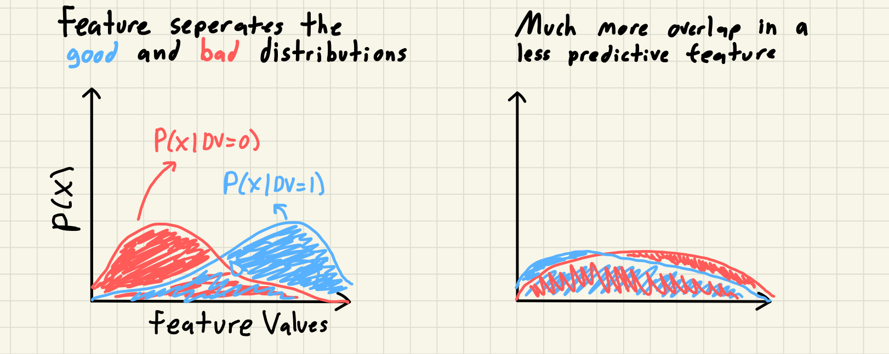
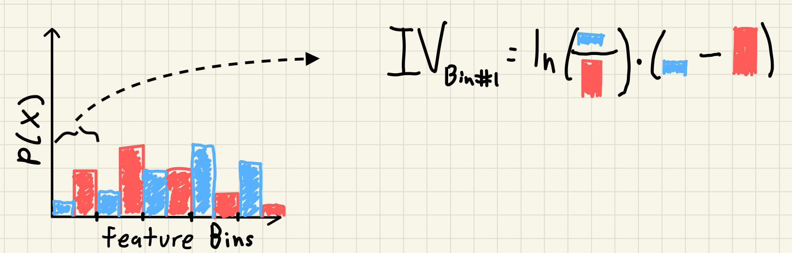
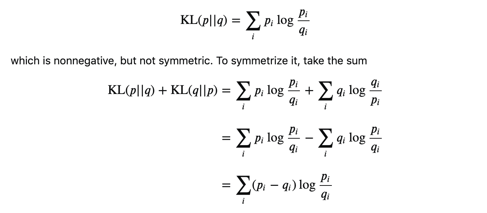

# Calculating Weight of Evidence and Information Value in Python

Sometimes in my Data Science projects I need a quick and easy way to
measure and visualize a predictive trend for several independent
variables. My go to way to do this is to use Weight of Evidence and
Information Value. Recently I put together some code in python to
calculate these values and wanted to show how you can leverage these
concepts to learn more about the relationship between your independent
and dependent variables. These measures certainly aren’t perfect but I
think they are an underutilized technique in the exploratory data
analysis field.

### What is Information Value and Weight of Evidence?

Information Value (IV) is a way to measure the strength of relationship
between a feature and a dependent variable (DV). Weight of Evidence
(WOE) is an individual bin’s or category’s logged risk ratio. I can’t
find any information online about the history of it’s development but I
first encountered this concept working at Equifax and have mostly seen
resources online from banking and risk modeling. The intuition behind IV
is simple; a feature that seperates the distribution of the outcomes of
DV is a predictive feature that, all else being equal, you should prefer
over a feature that doesn’t. This is typically discussed with a binary
DV where we use the distribution of the different labels of the DV,
referred to as goods vs bads. We can see this visually if we look at two
hypothetical features and the distribution of the DVs within each
feature.



Although interestingly you will commonly read descriptions of Weight of
Evidence referring to “the distribution of goods and bads” in your DV.
But really we are measuring the *distribution of the feature* for each
seperate population of the DV labels. To do this we group our feature
into bins and then calculate the percentage of goods and bads in each
bin; again essentially creating a histogram of the feature for the good
and bad population using consistent bin edges. Once we have our two
distributions we can actually get to calculating the IV. The formula for
WOE and IV is always shown as follows:

$$\displaylines{
    WOE_i = \ln(\frac{good_i}{bad_i}) \\
    IV = \sum\_{i=1}^N WOE_i \* (good_i - bad_i)
}
$$

where *g**o**o**d*<sub>*i*</sub> and *b**a**d*<sub>*i*</sub> is the
percentage of the overall goods and bads in each feature bin. We can see
this visually from our previous example with another poorly drawn
picture:



Our previous continuous distributions have been binned, and then for
each bin we take the product of the ratio of the WOE and the difference
in the two probability distributions.

If a feature bin has the same percentage of overall goods and bads
(e.g. the lowest bin contains 25% of the overall goods and 25% of the
overall bads) then that bin will have a WOE of 0 (*l**n*(1) = 0). If a
feature has no seperation of goods and bads in any bin then the overall
Information Value is also 0; the feature has no predictive power using
this measure.

### Pros and Cons of using Information Value

There are three main reasons that I prefer to use Information Value as a
measure of predictiveness to compare different features over other
methods: 1. You can calculate IV for both numeric and categorical
features and compare them across feature types. With a numeric feature
we first bin the data into groups and after that we can use the exact
same code as if we were calculating WOE for categorical bins. 2. Missing
values are handled automatically and can be treated as if they were a
seperate category. In Python we just need to ensure that none of the
steps are dropping them silently (e.g. `groupby(..., dropna = False)`).
This also has the added benefit of giving you information about
potentially imputing missing values. 3. Low frequency categories have
low impact on the variable’s Information Value. If you look at the
formula for Information Value we can essentially treat the term for the
difference in the percentage of goods and bads in a group as a “weight”
on the WOE. If we rewrite our formula from before that used
*g**o**o**d*<sub>*i*</sub> and *b**a**d*<sub>*i*</sub> as the overall
percentage of each label in the bin to now use the number of
observations in each bin, *n*<sub>*i*</sub>, and the bin specific
*p*(*b**a**d*)<sub>*i*</sub> as the percentage of observations in each
bin that are bad we can see this weighting directly.

$$\displaylines{
bad_i = \frac{n_i \* p(bad)\_i}{n\_{bads}} \\
good_i = \frac{n_i \* (1 - p(bad)\_i)}{n\_{goods}} \\
IV = \sum\_{i=1}^N WOE_i \* (\frac{n_i \* (1 - p(bad)\_i)}{n\_{goods}} - \frac{n_i \* p(bad)\_i}{n\_{bads}}) \\
IV = \sum\_{i=1}^N WOE_i \* \frac{n_i}{n\_{goods} \* n\_{bads}} \* (n\_{bads} - p(bad)\_i \* (n\_{bads} + n\_{goods})) 
}
$$

Honestly this last term is quite ugly but it does tell us a few
things: 1. As the size of the bucket, *n*<sub>*i*</sub>, decreases the
information value contribution for this bin also decreases 2. The
information value for a feature is influenced by how balanced the
overall labels are but an individual bin’s IV only changes with the
number of obs in the bin and how large or small the
*p*(*b**a**d*)<sub>*i*</sub> term is

We can also calculate an example directly to see the different
contributions of four hypothetical categories; 2 rare categories and 2
more common categories with each size having one informative feature and
and one with less seperation of the DV.

<table style="width:100%;">
<colgroup>
<col style="width: 14%" />
<col style="width: 14%" />
<col style="width: 14%" />
<col style="width: 14%" />
<col style="width: 14%" />
<col style="width: 14%" />
<col style="width: 14%" />
</colgroup>
<thead>
<tr class="header">
<th style="text-align: center;">Category Label</th>
<th style="text-align: center;">% of obs</th>
<th style="text-align: center;">% of goods</th>
<th style="text-align: center;">% of bads</th>
<th style="text-align: center;">WOE</th>
<th style="text-align: center;">Relative Diff</th>
<th style="text-align: center;">IV</th>
</tr>
</thead>
<tbody>
<tr class="odd">
<td style="text-align: center;">Cat 1</td>
<td style="text-align: center;">1%</td>
<td style="text-align: center;">1.1%</td>
<td style="text-align: center;">0.9%</td>
<td style="text-align: center;">0.20</td>
<td style="text-align: center;">0.002</td>
<td style="text-align: center;">0.0004</td>
</tr>
<tr class="even">
<td style="text-align: center;">Cat 2</td>
<td style="text-align: center;">1%</td>
<td style="text-align: center;">2%</td>
<td style="text-align: center;">0.5%</td>
<td style="text-align: center;">1.39</td>
<td style="text-align: center;">0.015</td>
<td style="text-align: center;">0.021</td>
</tr>
<tr class="odd">
<td style="text-align: center;">Cat 3</td>
<td style="text-align: center;">10%</td>
<td style="text-align: center;">11%</td>
<td style="text-align: center;">9%</td>
<td style="text-align: center;">0.20</td>
<td style="text-align: center;">0.02</td>
<td style="text-align: center;">0.004</td>
</tr>
<tr class="even">
<td style="text-align: center;">Cat 4</td>
<td style="text-align: center;">10%</td>
<td style="text-align: center;">20%</td>
<td style="text-align: center;">5%</td>
<td style="text-align: center;">1.39</td>
<td style="text-align: center;">0.15</td>
<td style="text-align: center;">0.201</td>
</tr>
</tbody>
</table>

**Cat 2** has the same good to bad ratio as **Cat 4** but 1/10th the
contribution to the feature’s Information Value statistic because it
only has 1/10th of the observations.

Of course no method is perfect and without it’s tradeoffs. Here are some
of the main drawbacks to using WOE and IV as measures of feature
predictiveness: 1. Binning your numeric values can cause you to lose
some predictive power in your feature. There are many sources that have
written on this but I would recommend starting with Frank Harrell’s
[data method
notes](https://discourse.datamethods.org/t/categorizing-continuous-variables/3402)
2. The number of bins to group your numeric features into or the max
number of categories to consider is a parameter that you need to pick
and could impact the value and relative rank of Information Value for
different features. You could run some bootstrap simulations to quantify
how big of an effect this might cause in your specific datasets. 3. If
either distribution of goods or bads in a bin is exactly 0 then you will
receive divide-by-0 errors. To correct this I add a small bit of noise
to each bin’s distribution but this may result in strange results if
your bins are too small or the outcomes are too rare. 4. This measure
does not tell you anything else about your feature such as its
correlation with other variables and whether it is fit to be included in
your model.

As an exploratory measure I think that Information Value is still worth
using even with these faults but one could easily argue differently.

### Connection to Information Theory

A good question to ask is where did this formula come from? Why do you
take the natural log of the ratio of goods and bads, but not the
difference? What if you put the bads in the numerator and subtract the
goods away? Luckily [people smarter than
me](https://stats.stackexchange.com/a/462445) have shown that the
Information Value is an equivalent expression of the symmetric
KL-Divergence measure of two distributions:



The KL-Divergence is grounded in information theory and is a common
measure of how dissimilar two distributions *p* and *q* are. This way it
really doesn’t matter if you use the distribution of goods first or
last, you would get the same value either way.

### Extension to Continuous DVs

Most explanations online only go over the use case where you are trying
to predict a binary DV. If we have a continuous DV then we need a way to
adopt the WOE calculation with two distinct populations to compare like
we did with goods vs bads. The parallels between Information Value and
the KL-Divergence gives a direction to focus on; we want a distance
between a predictive and non-predictive distribution. One idea is that
we can compare the distribution of our continuous DV across our feature
to a baseline distribution as if the DV was evenly spread across the
feature distribution. If a feature is predictive then the DV will be
more concentrated in certain areas of the feature (e.g. linear feature =
higher DV share at top end, quadratic = higher DV share at tails, etc…)
compared to a uniform concentration for a non-predictive feature. We do
have to make an adjustment to the calculations to ensure that every
value of our DV is positive but WOE is scale invariant so this doesn’t
change any outcomes.

### Calculations in Python

I have put together a python file that can perform the full gamut of
actions needed to find WOE and IV for both numeric and categorical
features on my personal github. Here I will just show the code to
calculate the individual WOE and IV statistics since that was the focus
of the blog and to keep it short. You can view the full code here.

``` python
def calc_woe(df, feature_col, dv_col, min_obs = 1, **bin_args):
    '''
    Calculate the WOE and IVs for the categories of the feature
    
    :param df: The dataframe containing the columns to use
    :param feature_col: The name of the column that contains the feature values
    :param dv_col: The name of the column that contains the dependent variable
    :param min_obs: The amount to add to each numerator and denominator when
                    calculating the percent of overall goods and bads to avoid
                    taking logs of 0
    '''
    df_ = df[[feature_col, dv_col]].copy()
    dv_levels = df_[dv_col].unique()
    
    if len(dv_levels) != 2:
        raise(f'Need only 2 levels for {dv_col}')
    
    num_bads = np.sum(df_[dv_col] == dv_levels[0])
    num_goods = np.sum(df_[dv_col] == dv_levels[1])
    
    if str(df_[feature_col].dtype) in ['string', 'category']:
        df_[feature_col + '_bins'] = trim_categories(df_[feature_col], bin_args['bins'])
    else:
        df_[feature_col + '_bins'] = bin_data(df_[feature_col], **bin_args)
    
    df_counts = (
        df_.
        groupby([feature_col + '_bins'], dropna = False).
        apply(lambda df: pd.Series(dict(
            num_obs = df.shape[0],
            num_bads = np.sum(df[dv_col] == dv_levels[0]),
            num_goods = np.sum(df[dv_col] == dv_levels[1])
        ))).
        reset_index()
    )
    
    df_counts['pct_goods'] = (df_counts['num_goods'] + min_obs) / (num_goods + min_obs)
    df_counts['pct_bads'] = (df_counts['num_bads'] + min_obs) / (num_bads + min_obs)
    df_counts['woe'] = np.log(df_counts['pct_goods'] / df_counts['pct_bads'])
    df_counts['iv'] = df_counts['woe'] * (df_counts['pct_goods'] - df_counts['pct_bads'])
    
    return df_counts
```

And here you can see a sample output of using this function on the
classic `mpg` dataset to predict if a car is fuel effecient or not.

``` python
mpg['fuel_effecient'] = 1.0 * (mpg['hwy'] > 30)
calc_woe(mpg, 'manufacturer', 'fuel_effecient', bins = 10)
```

| manufacturer_bins | num_obs | num_bads | num_goods | pct_goods |
pct_bads | woe | iv
||—:|:——————–|———-:|———–:|————:|————:|———–:|———-:|———–:|  
 0 | audi | 18 | 17 | 1 | 0.0454545 | 0.0801887 | -0.558302 | 0.0193921
|  
 1 | chevrolet | 19 | 19 | 0 | 0 | 0.0896226 | -4.5067 | 0.403903 |  
 2 | dodge | 37 | 37 | 0 | 0 | 0.174528 | -5.1678 | 0.901927 |  
 3 | ford | 25 | 25 | 0 | 0 | 0.117925 | -4.77849 | 0.563501 |  
 4 | *other* | 33 | 26 | 7 | 0.318182 | 0.122642 | 0.948375 | 0.185445
|  
 5 | hyundai | 14 | 13 | 1 | 0.0454545 | 0.0613208 | -0.29382 |
0.00466181 |  
 6 | nissan | 13 | 11 | 2 | 0.0909091 | 0.0518868 | 0.552646 | 0.0215655
|  
 7 | subaru | 14 | 14 | 0 | 0 | 0.0660377 | -4.20526 | 0.277706 |  
 8 | toyota | 34 | 26 | 8 | 0.363636 | 0.122642 | 1.08151 | 0.260639 |  
 9 | volkswagen | 27 | 24 | 3 | 0.136364 | 0.113208 | 0.184614 |
0.00427495 |

To get the full information value for this feature we just sum the
individual category’s IVs.

I hope this helps some people adapt this technique in their work and
analysis.
